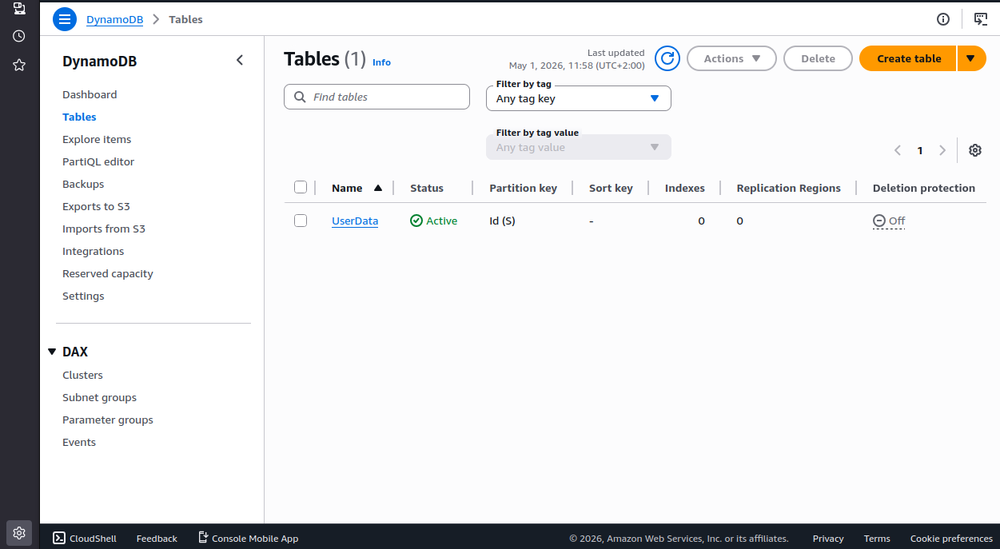
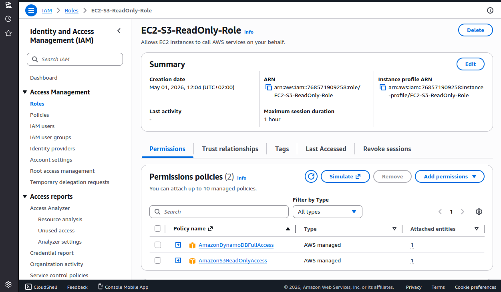
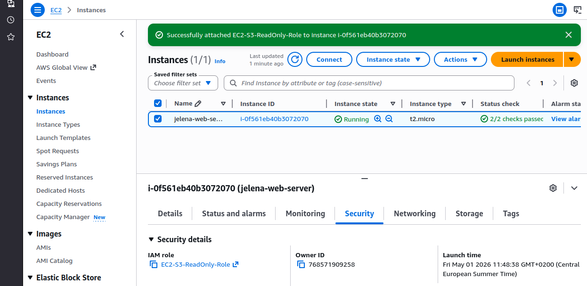
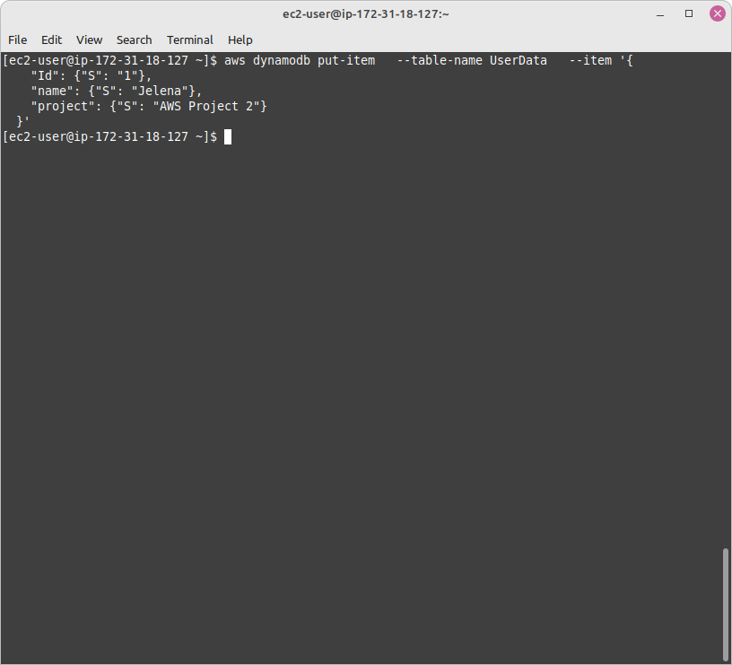
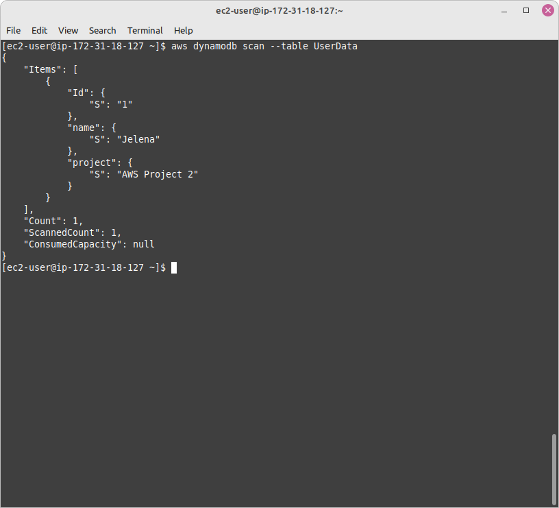
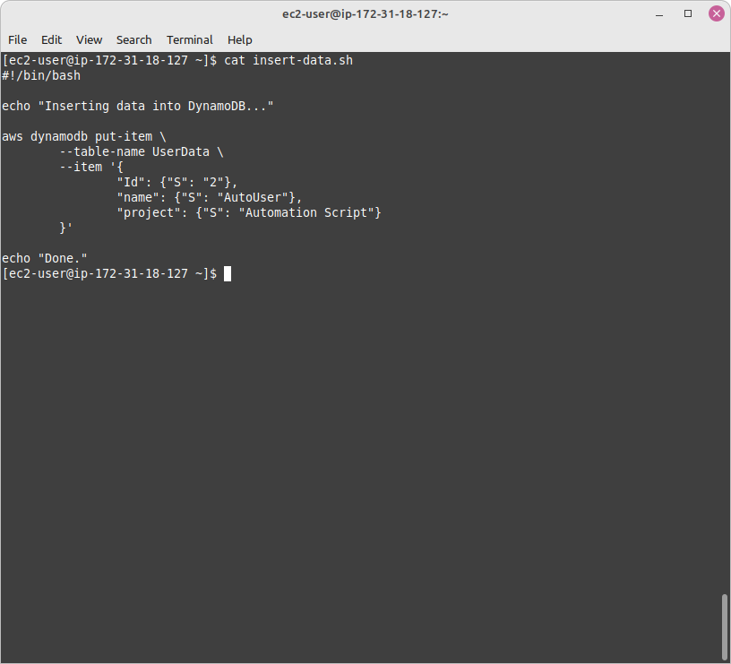
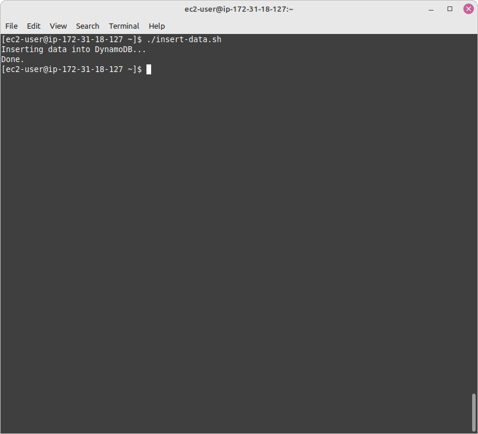
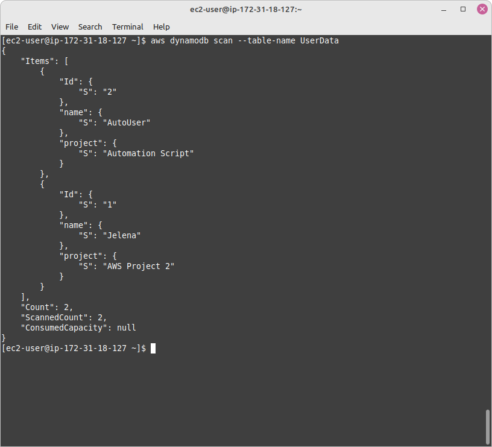

# AWS DynamoDB Data Management from EC2 using AWS CLI

## Overview

This project shows how to interact with AWS DynamoDB from an EC2 instance using the AWS CLI.
It includes creating a table, inserting and retrieving data, and automating data insertion using a Bash script.

This builds on the EC2 environment by adding basic database interaction.

---

## Architecture
-Amazon EC2 (Amazon Linux)
-DynamoDB table (UserData)
-IAM role with DynamoDB permissions
-AWS CLI installed on EC2
-Bash script for automation

---

## Functionality
-Created and configured a DynamoDB table
-Inserted items using AWS CLI (put-item)
-Retrieved data using scan operation
-Automated data insertion using a Bash script

---

## Steps Performed

### 1. DynamoDB Setup
- Created a DynamoDB table with partition key Id (String type)
  

### 2. IAM Configuration
- Attached an IAM role with DynamoDB permissions to the EC2 instance
  
  

### 3. Data Operations
- Inserted items into the table using AWS CLI (put-item)
  
- Retrieved items using the scan operation
  

### 4. Automation
- Created a Bash script to automate inserting data into DynamoDB
  
  
  

### 5. View the table after inserting the data
- Performed the scan operation on the table
  
  

---

## Script Example

```bash
#!/bin/bash

aws dynamodb put-item \
  --table-name UserData \
  --item '{
    "Id": {"S": "2"},
    "name": {"S": "AutoUser"}
  }'

---

## Key Skills Demonstrated
-AWS DynamoDB table creation and management
-AWS CLI usage for database operations
-IAM role configuration for secure access
-Linux-based interaction with AWS services
-Basic Bash scripting for automation

## Author
Jelena
